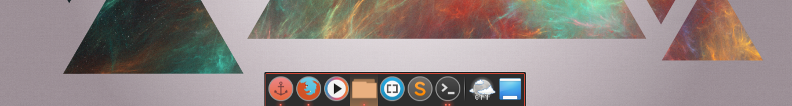
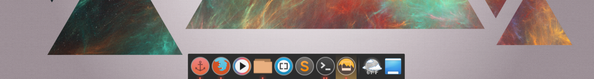
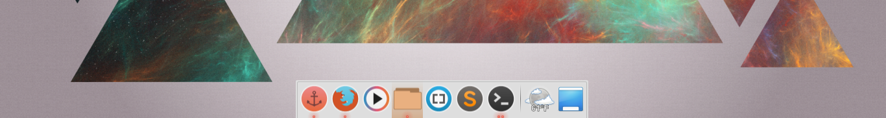

#Docky themes for use with the Numix theme suite
Thank you Numix Guys! http://numixproject.org/
Give them your moneys!

The themes
----
Red DK

White DK

Light

Installation
----
To install move the theme folders to ~/.local/share/docky/themes(create the 'themes' directory if it's not there). Or for all users /usr/share/docky/themes.
Please go to http://wiki.go-docky.com/index.php?title=Themes for information on themeing Docky